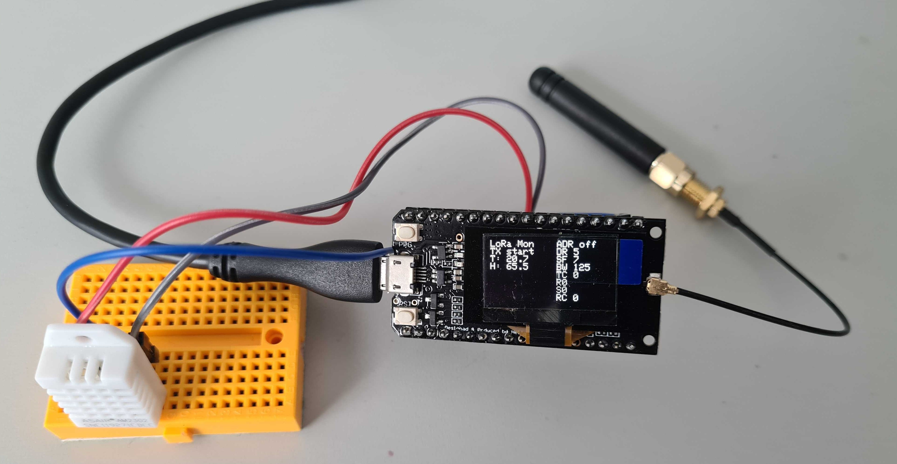

= TTGO LoRa Temperature Sensor

This example uses a TTGO LoRa32 V1 board with a Semtech SX1276 LoRa transceiver
and an onboard OLED display to demonstrate how to connect a DHT22 temperature
and relative humidity sensor to a LoRaWAN network (The Things Network, for example).

== Setup

=== DHT22 and LoRa antenna

* The signal pin of the DHT22 must be connect to pin 13. 
    This pin can be changed by adjusting the value of the macro `DHTPIN`.
* The VDD pin of the DHT22 must be connected to 3.3V power supply (the pin named "3.3").
* The GND pin of the DHT22 must be connected to the GND on the board.

WARNING: Make sure that the LoRa antenna is connected to the board before powering it on.
The board can be damaged if the antenna is not connected when powered on!

=== PlatformIO and Visual Studio Code

This project uses https://platformio.org/[PlatformIO] as development environment. It is available
as a https://platformio.org/platformio-ide[extension for Visual Studio Code].

Open the project folder in Visual Studio Code with an activated PlatformIO extension
and you should be able to build and flash the project onto a connected TTGO LoRa32 board.

=== Configuration

Copy the file `include/config_template.h` to `include/config.h`.
Adjust the values for APPEUI, DEVEUI, and APPKEY according to the settings required for your 
LoRaWAN network (e.g. the values provided by The Things Network). Note that the order/endianess of the
bytes is important (little and big endian).

== Display

The display shows status information about the current state of the LoRa stack.

On the left, it shows the current state (transmitting, idling, ...) below the heading.
Below that, the current temperature and humidity are shown.

On the right, different statsu information about the current LoRa connection are shown. For details
refere to the following table.

.Status information on display
|====
| T: | Temperature in degree Celsius
| H: | Relative humidity in %
| ADR | If on, the _adaptive data rate_ (ADR) is switched on, else off
| DR | _Data rate_, between 0 (slowest, most reliable) and 6 (fastest, least reliable); valid for EU868
| SF | _Spread factor_, between 7 (least spread, faster transmission) and 12 (widest spread, slower transmission)
| BW | _Band width_ in kHz, either 125kHz or 250 kHz
| TC | _Transmit counter_, number of messages transmitted
| RC | _Receive counter_, number of messages received
| R | _Received signal strength indicator_ (RSSI), indicates the signal strength of a received messages; the higher the better
| S | _Signal to noise ratio_ (SNR) in dB, the higher the value, the better the signal can be differentiated from the noise

|====

== Integration with the Workshop Cloud Stack

To utilise/process the data the sensor sends we want to integrate it with processing chain of services. 
The chain described here uses The Things Network (TTN) as a LoRa stack for managing the LoRaWAN devices and applications with an outgoing datastream via MQTT for the sensor data. A Node-RED instance, running in an AWS ECS cluster, is subscribing to this sensor data and forwarding it to an InfluxDB instance running in the same cluster for timeseries storage. The last step is visualizing the data, which is done by Grafana that fetches the from InfluxDB and allows you to build dynamic dashboards.

=== TTN Setup

The APPEUI, DEVEUI and APPKEY used in the configuration of `include/config.h` can be accquired through creating a device in the Things Network console.
To create an The Things Network account for free you can click https://account.thethingsnetwork.org/register[here].

=== MQTT Setup

We use the free tier of https://www.hivemq.com/mqtt-cloud-broker/[HiveMQ Cloud] for which you can register on their website.

=== AWS ECS Setup

The AWS ECS cluster containing Node-RED, InfluxDB and Grafana is set up by the help of docker and a docker-compose.yml. For that Docker 19.03 or later is required.

IMPORTANT: The resources created in this workshop use services/resources that produce costs in AWS!

The included docker-compose.yml in this repository describes all three services. To deploy those in a ECS cluster you need to have AWS credentials ready either as environment variables or an existing profile. The quickstart is described in the codeblock below:

[source,text]
----
docker compose context create ecs lpwan-workshop
docker compose context use lpwan-workshop

docker compose up
----

First we create a docker context that connects to AWS and offers special commands or translates docker-compose files for ECS. Next up you specify that you want to use this context and then can start the compose stack through docker-compose up. The deployment step takes some time sinc it creates multiple ressources in the background, like an Load Balancer, EFS volumes, the cluster, roles and security groups.

NOTE: The initial deployment should have failed because of the Node-RED container failing to start since he can't find its config file in the associated EFS volume. This needs to be uploaded now

To upload config files to an EFS there are multiple ways to do that. One way would be to temporarily use AWS Transfer Family to create an SFTP endpoint for a specific EFS volume. How to upload the Node-RED config to an example Transfer endpoint is shown below.

NOTE: In the docker-compose volume for Node-RED it is described that it should be accessed with UID/GID 0 aka the root user. Node-RED doesn't use the root user, so if you get permission errors you need to adjust the UID/GID to 1000 aka the Node-RED user.

[source,text]
----
# Upload config file for Node-RED
sftp -i rsa lpwan@s-bd4cb04f842b4370a.server.transfer.eu-west-1.amazonaws.com

>>> put resources/settings.js
----

==== Accessing the services

Inside `EC2 > Load Balancer` you can find a load balancer that was created through the deployment which has an DNS name associated with it that can be used to access the services inside the cluster, e.g. `lpwan-loadb-zn25zuton15n-f9a5448cb4a021e3.elb.eu-west-1.amazonaws.com`
By appending the port of the corresponding service to the URL you can e.g. access Node-RED: `https://lpwan-loadb-zn25zuton15n-f9a5448cb4a021e3.elb.eu-west-1.amazonaws.com:1880/`

.Service Credentials
|====
| **Service**  | **Username** | **Password**
| node-red | admin | `lpwan-handson` (See below how to change the password)
| influxdb | admin | `lpwan-handson` (Can be changed in `docker-compose.yml`)
| grafana  | admin | `admin` (Needs to be changed on first login)

|====

The password for Node-RED can be changed by executing the following commands in the directory of the project:

[source,text]
----
docker run --rm --name nodered -v $(pwd)/resources:/data -d nodered/node-red
docker exec -it nodered node_modules/node-red/bin/node-red-pi admin hash-pw
----

== Links

* https://learn.adafruit.com/the-things-network-for-feather/arduino-setup[Tutorial by Adafruit]
* https://randomnerdtutorials.com/ttgo-lora32-sx1276-arduino-ide/[Tutorial by randomnerdtutorials]

* https://github.com/mcci-catena/arduino-lmic[Github repository Arduino LMIC]
* https://github.com/mcci-catena/arduino-lmic/tree/master/doc[Documentation for Arduino LMIC (with LoRa general docs)]
* https://docs.docker.com/cloud/ecs-integration/[Deploying Docker containers on ECS]

